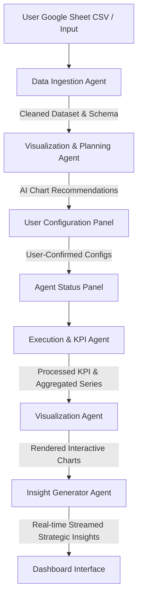

# ShopEasy Data Analyst Agent — Multi-Agent Architecture

The ShopEasy Data Analyst Agent is designed as a collaborative, multi-agent frontend system. Each agent operates with distinct responsibilities, communicating via a shared client-side execution context (the **Blackboard Pattern**).

Below is the detailed architectural breakdown of each agent:

---

## 1. Data Ingestion Agent
* **Role**: Primary Parser, Validator, and Schema Profiler.
* **Responsibilities**:
  * Silently fetches raw CSV data from the user-provided Google Sheet URL.
  * Parses raw text CSV into structured JSON objects.
  * Standardizes and parses all date columns using the strict `DD-MM-YYYY` format.
  * Infers column data types (Date, Number, Text, Category) based on contents.
  * Detects dataset metadata (row count, distinct category counts, date ranges).
* **Inputs**: Raw Google Sheet CSV URL.
* **Outputs**: Cleaned JSON dataset, dynamically inferred Schema, sample records (first 3 rows), and descriptive dataset stats.

---

## 2. Visualization & Planning Agent
* **Role**: Visual Consultant and UX Formulator.
* **Responsibilities**:
  * Combines the dataset schema, dynamic columns, and the user's business questions (up to 5).
  * Constructs optimized system prompts and calls the **Gemini 2.5 Flash API**.
  * Recommends optimal chart configurations (e.g., bar, line, donut, scatter).
  * Assigns correct columns to X and Y axes depending on data compatibility (e.g., categories/dates for X, numbers for Y).
  * Provides natural-language business reasoning for each choice.
* **Inputs**: Dataset Schema, Sample Rows, and User Questions.
* **Outputs**: Array of recommended chart configurations (Chart Type, X-Column, Y-Column, Reasoning).

---

## 3. Execution & KPI Agent
* **Role**: Analytical Processor.
* **Responsibilities**:
  * Scans the validated dataset to locate key metrics.
  * Dynamically computes key performance indicators (KPIs) based on matching column semantics:
    * **Total Revenue**: Sum of columns matching `revenue`, `sales`, `amount`, `total`, `price`.
    * **Total Orders**: Count of transactions or unique IDs in columns matching `order`, `id`, `transaction`.
    * **Average Delivery Days**: Average of columns matching `delivery`, `shipping`, `days`, `transit`, `lead time`.
  * Standardizes results and logs timestamped execution notes to the terminal-style operations console.
* **Inputs**: Cleaned Dataset.
* **Outputs**: Dynamic KPI calculations, log streams, and calculated value objects.

---

## 4. Visualization Agent
* **Role**: Graphical Presenter.
* **Responsibilities**:
  * Transforms the raw records based on user-confirmed (or modified) chart configurations.
  * Handles aggregation automatically (e.g., grouping by Category or Date and summing/averaging the Y-axis metric).
  * Renders premium, interactive charts one-by-one using a high-performance visual library (e.g., Chart.js with dark-mode optimizations, glowing line shadows, and hover animations).
  * Logs render completion timestamps for individual question charts.
* **Inputs**: Confirmed Chart Configurations and Cleaned Dataset.
* **Outputs**: Fully rendered dynamic charts attached to responsive HTML5 canvas wrappers.

---

## 5. Insight Generator Agent
* **Role**: Strategic Analyst.
* **Responsibilities**:
  * Assembles data snapshots, including calculated KPIs, user questions, and aggregated chart summaries.
  * Initiates a streaming call to the **Gemini 2.5 Flash API** (`streamGenerateContent`).
  * Generates exactly up to 5 strategic, high-value, actionable insights for a business leader.
  * Streams bullet points in real-time, parsing chunks on-the-fly.
  * Ensures each bullet point includes at least one specific numerical metric from the data, proposes a clear business action, and avoids any developer jargon.
* **Inputs**: Calculated KPIs, Aggregated Chart Series, Schema, and Business Questions.
* **Outputs**: A real-time, character-by-character or bullet-by-bullet stream of high-impact strategic business recommendations.
